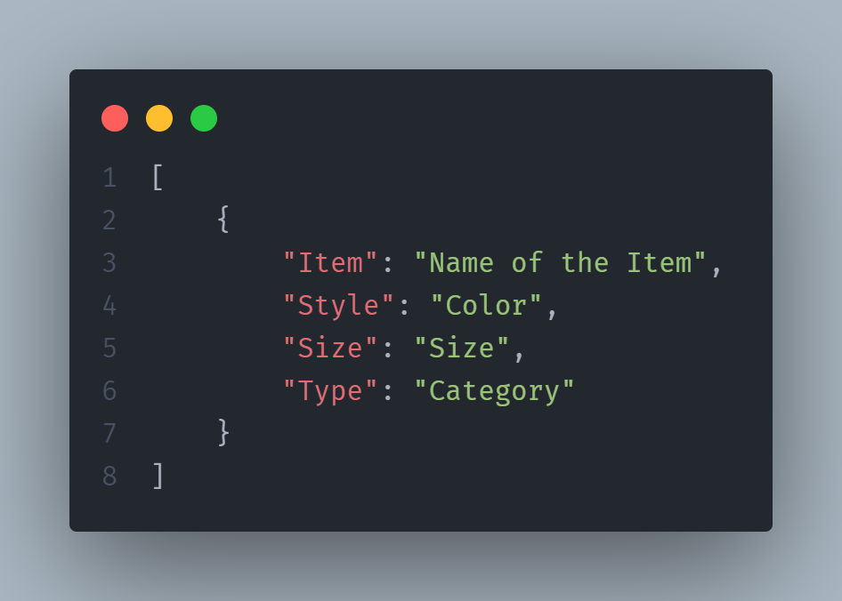
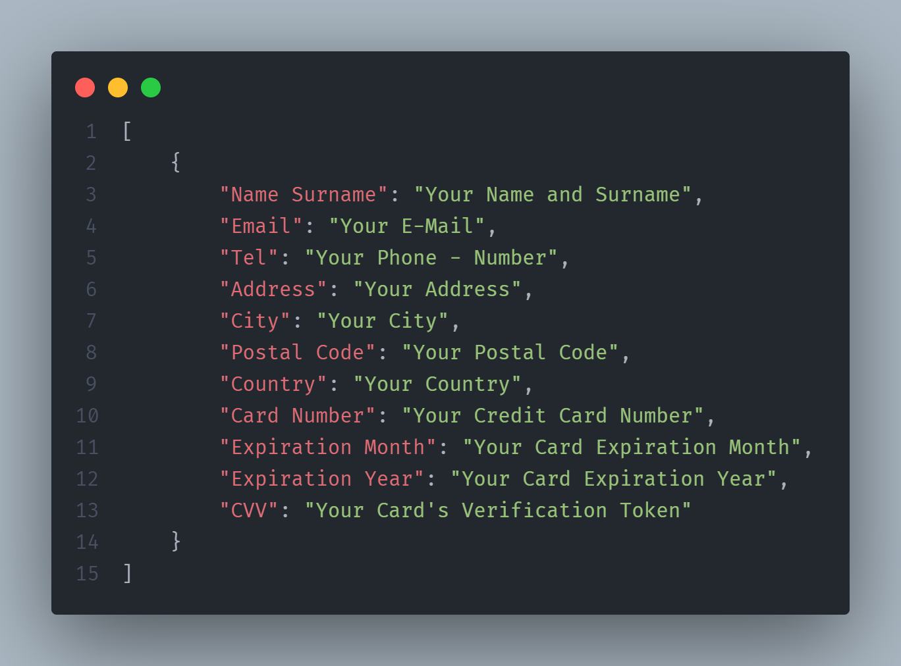

# Supreme-Bot
Supreme Bot is a free system for Buying Supreme's Items on the Day of the Supreme Shop's Drop!

## Set Up
Download the ZIP Folder, or Clone the Repository with:
```
git clone https://github.com/TonicStark/supreme-bot.git
```

Then install the dependencies in a virtualenv, you can create one via `python -m venv <name of the virtualenv>`, with:
```python
pip install -r requirements.txt
```

After you install the dependecies, run this command:
```
playwright install
```
This will install ALL the Web Drivers you will need to run Playwright on your machine.

## Personalization
Now that you have set up your environment you can add Items to the `Items.json` file with this parameter sequence:



Now you have to modify the data in the `Data.json` file to suits your needs, like that:



## Start the Bot
Now you have only to run the `main.py` file just before the drop, which is at 12:00 in Italy. You can modify the hours and minutes, specifically:


Make sure to include the items you want to buy in the list, which is in the `Item.json` file and you are good to go! The Bot will buy the items you requested within seconds! **Happy Shopping!**