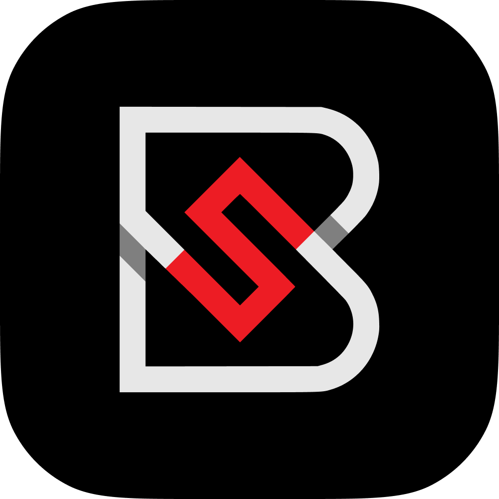
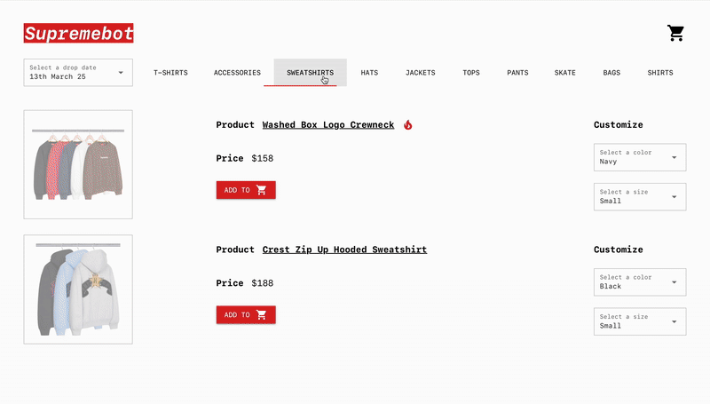

<div align="center">
  
  <h1>🧢 SupremeBot: Supreme Item Purchasing Bot</h1>
</div>

<div align="center">
  <a href="https://www.buymeacoffee.com/saccofrancesco">
    
  </a>
</div>

<h4 align="center">A fast and intuitive Supreme bot built with <a href="https://nicegui.io" target="_blank">NiceGUI</a> to streamline your shopping during Supreme drops.</h4>

<p align="center">
  
  
  
</p>

<p align="center">
  <a href="#tldr">TL;DR</a> •
  <a href="#key-features">Key Features</a> •
  <a href="#quickstart">Quickstart</a> •
  <a href="#emailware-share-your-thoughts">Emailware</a> •
  <a href="#credits--acknowledgements">Credits</a> •
  <a href="#license">License</a>
</p>

<div align="center">
  
</div>

---

## 📌 TL;DR

SupremeBot helps you get ahead of the drop by tracking items, showing their hype rating, and letting you pre-fill your basket and checkout — all wrapped in a clean NiceGUI interface.

---

## 🔑 Key Features

* **⚡ Intuitive Web Interface** – User-friendly GUI to get started in seconds.
* **🟢 Real-Time Item Tracking** – Monitor availability and view upcoming releases live.
* **🔥 Hype Counter** – Each item shows a demand score to guide your priorities.
* **🧺 Pre-Add to Basket** – Queue your must-haves for ultra-fast checkout.
* **📝 Autofill Checkout Forms** – Skip typing with saved personal and payment details.
* **🖥️ Full-Screen Mode** – Focused shopping experience, no distractions.
* **💻 Cross-Platform Support** – Works on Windows, macOS, and Linux seamlessly.

---

## ⚡ Quickstart

Make sure you have [Git](https://git-scm.com), [Python](https://www.python.org/downloads/), and [pip](https://pip.pypa.io/en/stable/) installed.

```bash
# 1. Clone the repository
git clone https://github.com/saccofrancesco/supremebot.git
cd supremebot

# 2. Install Python dependencies
pip install -r requirements.txt

# 3. Install Playwright browser binaries
playwright install

# 4. Run the bot
python main.py
```

---

## 📬 Emailware: Share Your Thoughts

SupremeBot is [emailware](https://en.wiktionary.org/wiki/emailware) — if you find it useful, I’d love to hear from you! Whether it's feedback, ideas, or just a quick hello:

📩 **[francescosacco.github@gmail.com](mailto:francescosacco.github@gmail.com)**

---

## 🙏 Like SupremeBot? Support the Project

If SupremeBot made your shopping smoother:

* ⭐️ Star the repo
* 🧃 [Buy me a coffee](https://www.buymeacoffee.com/saccofrancesco)
* 💌 Send your feedback or ideas

---

## 🧠 Credits & Acknowledgements

Built with these awesome tools:

* [Python](https://www.python.org/)
* [NiceGUI](https://nicegui.io)
* [Playwright](https://playwright.dev/python/)
* [Requests](https://requests.readthedocs.io/en/latest/)
* [BeautifulSoup](https://www.crummy.com/software/BeautifulSoup/bs4/doc/)

---

## 📎 You Might Also Like...

Other projects from the same author:

* [🧩 crosswords](https://github.com/saccofrancesco/crosswords): Generate printable crossword puzzles with OCR & Streamlit.
* [🔐 lock](https://github.com/saccofrancesco/lock): A secure password manager using CustomTkinter.

---

## 📜 License

This project is licensed under the [MIT License](https://opensource.org/licenses/MIT) — feel free to use it in your own projects!

---

> GitHub [@saccofrancesco](https://github.com/saccofrancesco)